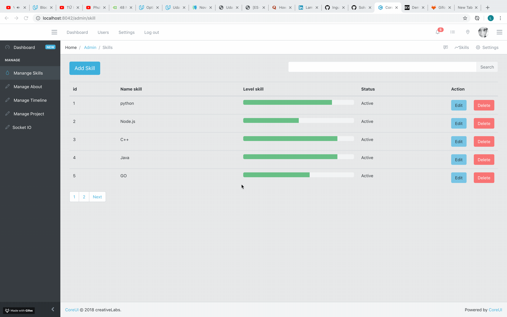

# Blog

This codebase can help you to set up your personal blog easily

# Overview

The project uses mysql database, so in order to configure your own database you need to have a relational database that which contain following tables:

skills

| id | name_skill  | level_skill  | status | created_at | updated_at

about

| id | content | created_at | updated_at

experience

| id | start | end | company | title | location

education

| id | start | end | degree | school | location 


Configuration for database can be found in config/database.js


# Views




# Set-up locally
```> git clone git@github.com:lnguyen-cpi/blog.git```

```> npm install```

```> node app.js```
